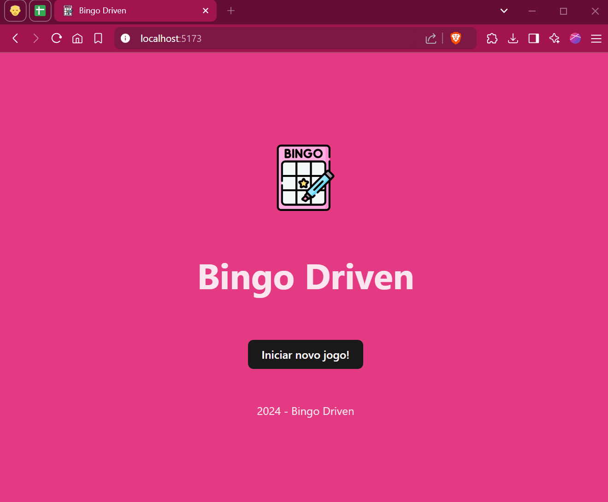

# bingo-driven
Sistema para a administração de jogos de bingo.

## Funcionalidades
- Criação de jogos de bingo.
- Geração de números para um jogo (sorteio).
- Finalização de jogos.
- Armazenamento dos jogos e seus números sorteados.

## Tecnologias
- Front-end: React e Vite.

## Link
- https://bingo-driven-front-end-orpin.vercel.app/

## Nome da imagem
- annylory/bingo-driven_frontend

## Usando o Docker para rodar o projeto manualmente
Os passos para subir manualmente são:
- Implementação do "Dockerfile" na raiz do projeto;
- Realizar o build da imagem:
    $ docker build -t <nome da imagem>
- Criar uma rede para comunicação dos containers:
    $ docker network create <nome da rede>
- Criar um volume:
    $ docker volume create <nome do volume>
- Subir o banco de dados em container, neste caso o Postgres:
    $ docker run -d \
    > --name <nome do container> \
    > --network <nome da rede> \
    > -e POSTGRES_PASSWORD=<senha de escolha> \
    > -p 5433:5432 \
    > postgres
- Subir o back-end em um container:
    $ docker run -d \
    > --name <nome do container> \
    > --network <nome da rede> \
    > -p 4000:4000 \
    > <nome da imagem>
- Subir o front-end em um container:
    $ docker run -d \
    > --name <nome do container> \
    > --network <nome da rede> \
    > -p 8000:80 \
    > postgres

## Usando o Docker Compose para rodar somente o front-end
O docker compose permite a automatização do processo para rodar o projeto através da criação do arquivo "docker-compose.yml", nesse caso, subiremos somente o front-end (observando a identação):

    services:
        <nome do serviço de banco de dados>:
            image: <nome da imagem>
            container_name: <nome do container>
            ports:
              - 5433:5432 (porta do host e porta do serviço, no caso, o postgres)
            networks:
              - <nome da rede>
            env_file: # ou "environment"
              - <caminho do arquivo .env> # ou variáveis de ambiente, ex: POSTGRES_PASSWORD: <senha de escolha>
            volumes:
              - <nome do volume>:caminho/para/persistencia/dos/dados # ex: <nome do volume>:/var/lib/postgresql/data
            healthcheck:
                test: ["CMD-SHELL", "<mensagem de confirmação do healthcheck> -q -d <nome da database> -U <nome do serviço>"]
                interval: 5s #por exemplo
                timeout: 5s #por exemplo
                retries: 5 # número de tentativas
        <nome do serviço de back-end>:
            image: <nome da imagem>
            container_name: <nome do container>
            build: back-end/ #por exemplo
            ports:
              - 5000:5000
            networks:
              - <nome da rede>
            depends_on:
                <nome do serviço de banco de dados>:
                    condition: service_healthy
            env_file: # ou "environment"
              - <caminho/do/arquivo/.env> # ou variáveis de ambiente, ex: POSTGRES_PASSWORD: <senha de escolha>
        <nome do serviço de front-end>:
            image: <nome da imagem>
            container_name: <nome do container>
            build: front-end/ #por exemplo
            ports:
              - 8000:80 (porta padrão de tráfego web)
            networks:
              - <nome da rede>
            depends_on:
            - <nome de serviço back-end>
    networks:
        <nome da rede>:
            name: <nome da rede>

    volumes:
        <nome do volume>:
    
Comandos para rodar o projeto usando o docker compose:
- Subir o projeto:
    $ docker compose up 
- Parar o projeto:
    $ docker compose stop
- Desmontar o projeto:
    $ docker compose down
- Recriar o projeto:
    $ docker compose up --build
               

